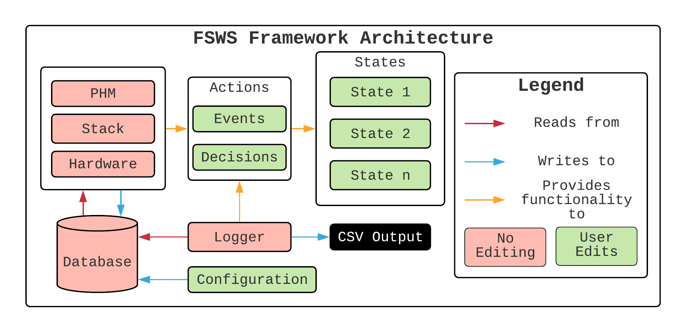
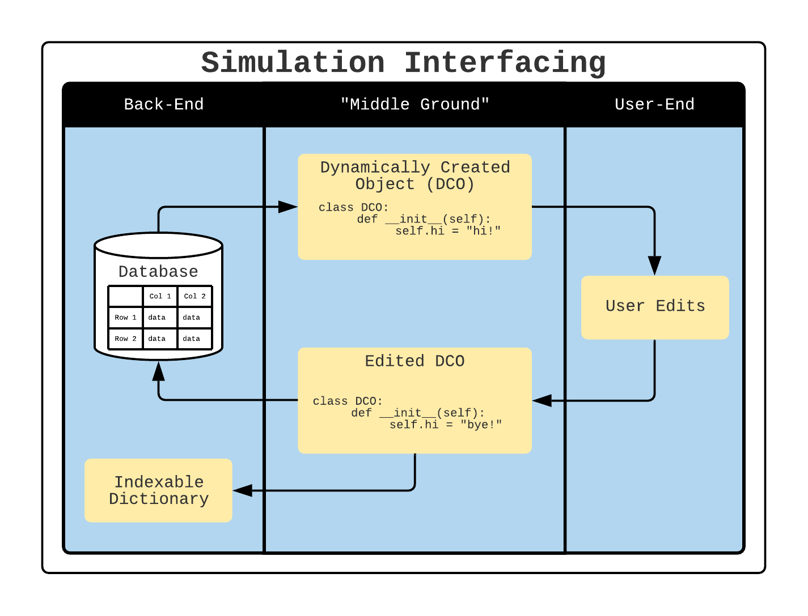

Architecture
============

It is important to understand how all of the components are connected to one another within the framework before starting to build the simulation. The power of this framework comes from the fact that you are able to dynamically create various pieces of hardware, health management thresholds, etc. This part of the documentation provides an overview of the architecture but does not go into detail explaining the implementation of the user-end of the framework.

The framework is split into components, which are pieces of the framework that provides unique functionality to interface between the user and the framework. This is accomplished through pre-defined methods and data structures. 

All components in red should not be edited by the user, as they are on the framework side. All components in green are intended to be stubbed out/edited by the user. Check the User Guide for more information regarding how to edit these components to simulte your software desgin. Note that the user should **never** have to write any data structures or methods to communicate with the simulation data base during runtime. The components of the framework are described in detail in the following sections.

Interfacing
-----------
The framework provides data structures to communicate and store data in the simulation. Thus, the user should **never** have to write any kind of method or data structure to communicate/store data in the framework.

The database is stored as a pandas Dataframe. The user will request this dataframe but will recieve a Dynamically Created Object (DCO) instead. The user will edit the DCO and then give it back to the specific component, which will then load it into the database but also store it in a dictionary that is used to make the object iterable.

The design choice of the DCO was to eliminate the need for the user to know 3rd party package operations. By giving the user the DCO, it will let them perform the built-in functionality that the language offers to edit the object.

Components
----------

It is worth noting that all manager components are iterable. For example, if we wanted to print what hardware is turned on:

.. code-block:: python

	for hardware_piece in hardware:
		if hardware_piece.is_on:
			print("{} is on!".format(hardware_piece.name))

Actions
^^^^^^^
The Actions component provide functinality to each state. This component is the bridge between the framework and the user: it utilizes the data structures and methods that the framework provides to manipulate, store, and move data. The methods that are found in this component are mostly written by the user and are called from each of the state sub-components.

In each method, the user will do the following (generally in this order):

* Create a new logger node and edit the string representation of what would be in the telementry logger.
* Edit the variables of the satellite (i.e. turning hardware on/off, initialize/terminate an algorithm, etc).
* Add the logger node to the logger.

More information about the Actions component and implementation can be found in the User Guide.

Configuration
^^^^^^^^^^^^^
The configuration file configures global variables and objects for the simulation. The configuration parameters are not specific to a sub-component, but ratherless specific to the satellite.

More information about the implementation of the configuration component can be found in the User Guide.

Database
^^^^^^^^
The database component is what one would think: it stores the data that is used in the simulation. All data is stored in the respective manager (i.e. any hardware-related data is stored in the Hardware Manager, health management-related data in the Health Manager, etc), and this component retrieves the databases and performs operations on them and stores them back.

All databases are in the form of a pandas DataFrame. When the user needs to edit a database, the user will recieve a Dynamically Created Object (DCO) instead of the dataframe. The reasoning behind this design choice is because the user would have to have prerequiste knowledge of the pandas library. Giving the user an object is easier because it adheres to OOP fundamentals.

The user will edit the attributes of the object, and then give it back to the manager. The manager then reads the attributes of the object and converts it to a pandas DataFrame, which is then stored back into the database. It also stores it in an indexable dictionary, allowing the component to be iterable.

Hardware Manager
^^^^^^^^^^^^^^^^
This component manages the hardware aspect parts of the satellite by storing the database for the hardware, as well as providing the user with methods to write, communicate, and perform operations on the hardware.

All hardware is put into the simulation in the configuration file through the `register` method:

.. code-block: python
	hardware.register('computer')
	hardware.register('solar_panel')

More information about hardware registration and implementation can be found in the User Guide.

Health Manager
^^^^^^^^^^^^^^
The Health Manager component stores the values of the satellite that, when breached, will send the satellite into some kind of safety mode. Think of this manager as the satellite doctor: it monitors the vitals of the satellite, and if something goes wrong, it will document that something has gone wrong with the health of the satellite.

These values are defined in the state sub-component that is generated using the stub. More specifically, the user will define what these values are in the `phm_values` method. The Health Manager parameters do not get defined in the configuration file.

Logger
^^^^^^
The logger component allows the user to log what is happening in the simulation. It provides the user a logger node, which is editable by the user. When the user adds the node to the logger, it will take the values that were modified before adding the node and add it to the node. Thus, the user doesn't have to retrieve the values themselves in the database; it's handled on the back-end.

The logger provides the output for the user in a CSV format.

Stack
^^^^^
The stack as of right now is a component that is not integrated into the framework, but will be upon release. It keeps track of what state the satellite is currently in and manages transitions to another state.

States
^^^^^^
States encapsulate the software's logic flow. This component is one of the essential components, as a single state acts as the driver code to the simultion. This component is comprised of several sub-components, with each individual state being defined as a sub-component. For example, your satellite would want to have a communications state, as well as a state to charge the batteries. This means that there are 2 sub-components for the state component.

Each state is generated using a stub. The user will fill out the stub accordingly once it is generated. The states interface directly with the Actions component through methods that are created by the user in the Actions component. The user will edit the `phm_values`, `decision_probability`, and `run_process` methods. More information about specifically editing these methods can be found in the User Guide and in the Tutorial. A sample stub looks as such:

.. code-block:: python

	from actions import Actions

	class SampleState:
    
	    '''Process code for Sample state.'''
    
	    def __init__(self):
	        self.state_name = 'sample'

	    def set_logger(self, logger_obj):
	        self.logger = logger_obj
    
	    def set_database(self, db_obj):
	        self.database = db_obj
    
	    def get_logger(self):
	        return self.logger
    
	    def get_db(self):
	        return self.database
    
	    def phm_values(self):
        
	        # ==== Edit this dictionary with the values for the Health Management System ====
	        # Example: 'satellite_temp' : (-20, 20)
	        #   means that the satellite temperature should not exceed -20C and 20C.
        
	        d = {}
        
	        # ===============================================================================
        
	        return d

	    def decision_probability(self):
        
	        # ==== Edit this dictionary with the probabilities for the diamond ====
	        # Example: 'check_if_computer_is_on' : 100
	        #   means that the diamond to check to see if the computer is on will
	        #   succeed 100% of the time.
        
	        d = {}
        
	        # =====================================================================
        
	        return d

	    def run_process(self):
	        '''Driver code to run a simulation for the Sample state. This method
	        calls methods from the Actions component.'''
        
	        actions = Actions(self.logger, self.database) # instantiates action class, sets logger and db
	        actions.phm = self.phm_values()
	        actions.probabilities = self.decision_probability()
        
	        # ==== vvvv YOUR CODE GOES BELOW THIS vvvv ====

    
	        # ==== ^^^^ YOUR CODE GOES ABOVE THIS ^^^^ ====
        
	        self.logger = actions.logger # gets the logger from the actions class.

It should be noted that each state is a **sub-component** of the states component, and that you can have an infinite number of states in the simulation.

